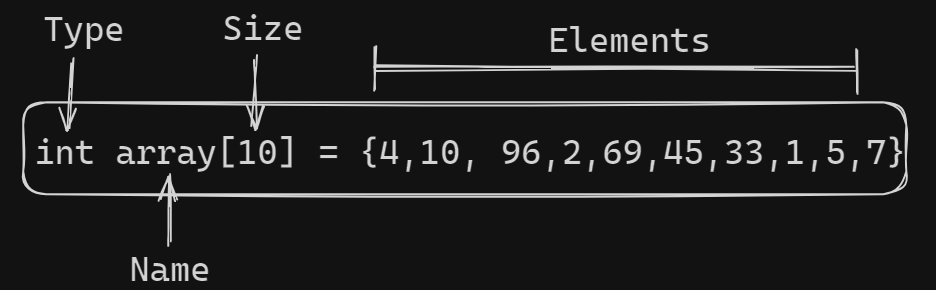
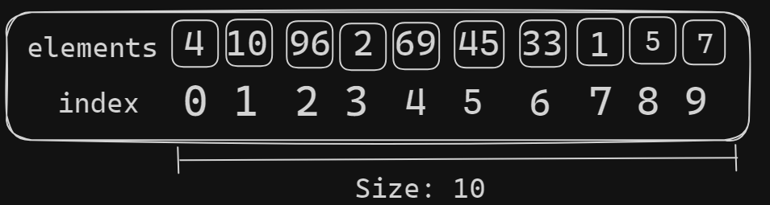

## Contributing

Contributions are always welcome!

See `contributing.md` for ways to get started.

Please adhere to this project's `code of conduct`.


# Data Structure and Algorithms in C

Data Structure and Algorithms (DSA) is  a specific way to store and organize data in a computer memroy so that these data can be used in effeciently later. The data may be  arranged in many different ways such as the logical or mathematical model for a particular organization of data is termed as data structure.
 
### The variety of a particular 
The variety of a particular data model depends on the two factors - 
 Firstly, it must be loaded enough in structure to reflect the actual relationships of 
the data with the real world object. 


 Secondly, the formation should be simple enough so that anyone can efficiently 
process the data each time it is necessary. 

## Categories of Data Structure
The data structure can be sub divided into major types:
| Type     | Description                | Examples |
 :------- | :------------------------- | ---------- |
 `Linear Data Structure` | A data structure is said to be linear if its elements combine to form any specific order. | Arrays, Queues , Stacks, etc
 `Non-Linear Data Structure` | This structure is mostly used for representing data that contains a hierarchical relationship among various elements. | Graphs, Family trees, table of content, etc |


 ## Linear Data Structure
 A data structure is said to be linear if its elements combine to form any specific order. 
There are basically two techniques of representing such linear structure within memory. 

 First way is to provide the linear relationships among all the elements 
represented by means of linear memory location. These linear structures are termed as 
arrays. 

 The second technique is to provide the linear relationship among all the elements 
represented by using the concept of pointers or links. These linear structures are 
termed as linked lists. 
The common examples of linear data structure are: 
Arrays 
 Queues 
 Stacks 
 Linked lists

## Non Linear Data Structure

This structure is mostly used for representing data that contains a hierarchical 
relationship among various elements. 
Examples of Non Linear Data Structures are listed below: 
 Graphs 
 Family of trees and 
 Table of contents 

### Tree
In this case, data often contain a hierarchical relationship among various 
elements. The data structure that reflects this relationship is termed as rooted tree 
graph or a tree.  

### Graph
In this case, data sometimes hold a relationship between the pairs of elements 
which is not necessarily following the hierarchical structure. Such data structure is 
termed as a Graph. 

### Array 
 Array is a container which can hold a fix number of items and these items should be of 
the same type. Most of the data structures make use of arrays to implement their 
algorithms. Following are the important terms to understand the concept of Array. 

 **Element** − Each item stored in an array is called an element. 
 **Index** − Each location of an element in an array has a numerical index, which is used to identify the element. 

## Array Representation: (storage structure)
Array can be declared  in various ways in different languages. 




As per above illustration, following are the important points to be considered.
+ Index starts with 0.
+ Array length is 10 which means it can store 10 elements.
+ Each element can be accessed via it's index.
  #### for example 

   ```c
  printf(index[8]);
   ``` 

    #### output : 1
    As from above example 

    ## Basic Opertions
    Following are the basic operations supported by an array.

    | Operations     | Description                | 
 :------- | :------------------------- | 
 `Traverse` | print all the array elements one by one.|
 `Insertion` |  Adds an element at the given index.|
 `Deletion`  | Deletes an element at the given index. |
 `Searching`   | Search for an element using the given index or by the value. |
 `Update` | Updates an element at the given index. |


## Data types

 In C, when an array is initialized with size, then it assigns defaults values to its 
elements in following order. 


| Data Types     | Default value    | 
 :------- | :------------------------- | 
 `bool` | false |
 `int` | 0 |
  `float` | 0 |
   `double` | 0.01 |
   `void  ` | NULL |
   `char ` | 0 |
   `wchar_t` | 0 |

   ### Insertion Operation

    Insert operation is to insert one or more data elements into an array. Based on the 
requirement, a new element can be added at the beginning, end, or any given index of  array. 

Here, we see a practical implementation of insertion operation, where we add data at  the end of the array − 

#### Algorithm
Let **LA** be a Linear Array (unordered) with N elements and **K** is a positive integer such 
that **K<=N**. Following is the algorithm where ITEM is inserted into the Kth position of LA

 ```
 1. Start
 2. Set J = N
 3. Set N = N + 1
 4. Repeat steps 5 and 6 while J >= K 
5. Set LA[J+1] = LA[J] 
6. Set J = J-1 
7. Set LA[K] = ITEM 
8. Stop 
 ```
 ### Example
 Following is the implementation of the above algorithm − 
  

  ```c
#include <stdio.h> 
 
main() { 
   int LA[] = {1,3,5,7,8}; 
   int item = 10, k = 3, n = 5; 
   int i = 0, j = n; 
   printf("The original array elements are :\n"); 
   for(i = 0; i<n; i++) { 
      printf("LA[%d] = %d \n", i, LA[i]); 
   } 
   n = n + 1; 
   while( j >= k) { 
      LA[j+1] = LA[j]; 
      j = j - 1; 
   } 
   LA[k] = item; 
   printf("The array elements after insertion :\n"); 
   for(i = 0; i<n; i++) { 
      printf("LA[%d] = %d \n", i, LA[i]); 
   } 
} 
  ```
  When we compile and execute the above program, it produces the following result − 
   #### Output
   ```
   The original array elements are : 
LA[0] = 1  
LA[1] = 3  
LA[2] = 5  
LA[3] = 7  
LA[4] = 8  


The array elements after insertion : 
LA[0] = 1  
LA[1] = 3  
LA[2] = 5  
LA[3] = 10  
LA[4] = 7  
LA[5] = 8  
   ```